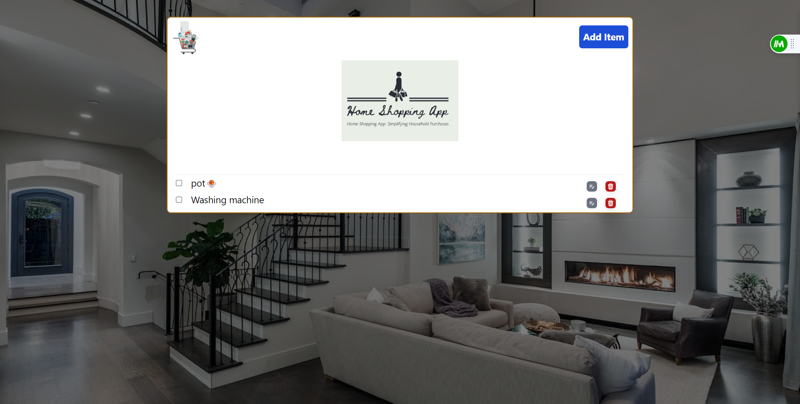

<div id="top"></div>
<div align="center">
    
</div>

# Home Shopping App

## Table of Contents
<details>
  <summary>Table of Contents </summary>
  <ol>
    <li><a href="#about-the-project">About The Project</a>
        <ul>
            <li><a href="#overview">Overview</a></li>
            <li><a href="#key-features">Key Features</a></li>
        </ul>
    </li>
    <li><a href="#built-with">Built With</a></li>
    <li><a href="#getting-started">Getting Started</a></li>
    <li><a href="#available-scripts">Available Scripts</a></li>
    <li><a href="#demonstration"> Demonstration</a></li>
    <li><a href="#Lessons-Learned">Lessons Learned</a></li>
    
  </ol>
</details>

 
## About The Project

The application helps you keep track of the items in your home, especially when you're moving to a new place or just want to stay organized. Its main purpose is to make it easy for you to know what you have and what you still need to get.


### Key Features

- Page Navigation: The ability to navigate between pages seamlessly.

- Removing items you no longer need.

- Editing item details when necessary.

- Adding new items with ease.

- Marking items as bought with a convenient strikethrough featur


### Overview

* [Repo Codes](https://github.com/ijayhub/home-shopping-firebase)
* [Hosted Link](https://home-shopping-firebase.vercel.app/)

<p align="right">(<a href="#top">back to top</a>)</p>

### Built With
- [React.js](https://react.dev/)

- [Tailwind CSS](https://tailwindcss.com/)

- [Firebase](https://firebase.google.com/)


<p align="right">(<a href="#top">back to top</a>)</p>

### Dependencies
- [react-router-dom](https://reactrouter.com/en/main)

- [react-icons](https://react-icons.github.io/react-icons/)

### Getting Started

To get a local copy up and running, follow these simple steps:

### Available Scripts

In the project directory, you can run:
```bash
`npm run dev`
```

Runs the app in the development mode.

Open [http://localhost:3000](http://localhost:3000) to view it in your browser.

The page will reload when you make changes.

You may also see any lint errors in the console.

<p align="right">(<a href="#top">back to top</a>)</p>

## Demonstration
* [Hosted Link](https://home-shopping-firebase.vercel.app/)

<p align="right">(<a href="#top">back to top</a>)</p>


## Lessons Learned

Que-What did you learn while building this project? What challenges did you face and how did you overcome them?

Ans-I've learned that when working with React, especially when implementing features like editing, it's crucial to obtain the unique ID of the item you want to edit. To achieve this, I utilized the `useParams() hook`, which allows me to efficiently access the ID parameter from the URL.

<p align="right">(<a href="#top">back to top</a>)</p>


